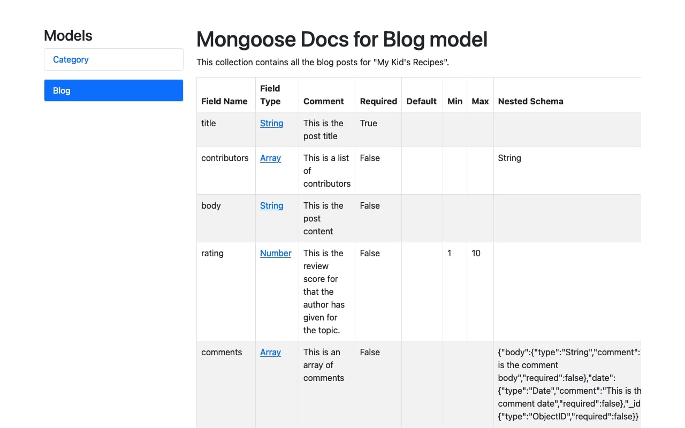

# Mongoose Docs

Documentation for your project is very important but also very time-consuming. Programmers often need to leave
documentation in the actual code for other developers and then write it again on the frontend for users who don't work
with the code.

Mongoose-docs allows you to comment your Mongoose schemas in the codebase and output it in a JSON format that can be
rendered on the frontend, so you won't need to copy-paste-copy-paste from your code to a Google Doc.



## Mongoose Compatability

Mongoose Docs works with Mongoose 5.x and 6.x. However, you need to ensure you are using the correct combination of
versions.

| Mongoose Version | Mongoose-Docs Version |
| --- | --- |
| v5.x | v1.x |
| v6.x | v2.x |

## Installation

`npm install mongoose-docs --save`

## Usage

1. Create your schemas and models. Fields can have a new `comment` property in the schema type which will be outputted
   in the JSON.
2. Execute the `mongooseDocsJSON` function and pass in `mongoose`. It will return the analyzed structure in a readable
   JSON format.
3. Optional: execute the `mongooseDocsOutputHTML` function and pass in the result from `mongooseDocsJSON` and the system
   directory for the documentation HTML files.

## Example

```javascript
import {mongooseDocsJSON, mongooseDocsOutputHTML} from "mongoose-docs";
import mongoose, {Schema} from "mongoose";

// Your schemas and models
const schemaOptions = {
    timestamps: true,
    comment: "This collection contains all the users.",
};
const userSchema = new Schema({
    email: {
        type: String,
        comment: "This is the user email", // New comment property on schema type
        required: true,
    },
    password: {
        type: String,
        comment: "This is the hashed password", // New comment property on schema type
        required: true,
    },
}, schemaOptions);
mongoose.model('User', userSchema);

// Pass in the Mongoose instance with the models implemented.
const schemaJSON = mongooseDocsJSON(mongoose);

// Optional: Output documentation into HTML files
mongooseDocsOutputHTML(schemaJSON, __dirname + "/docs");
```
